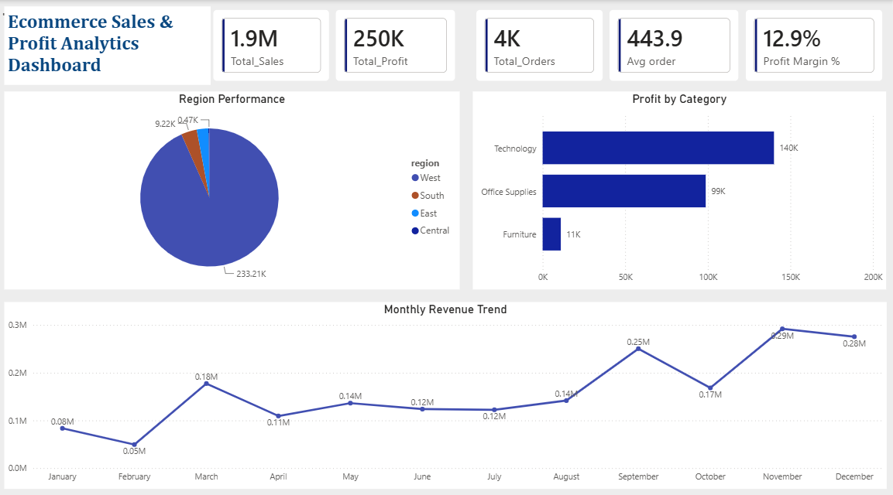
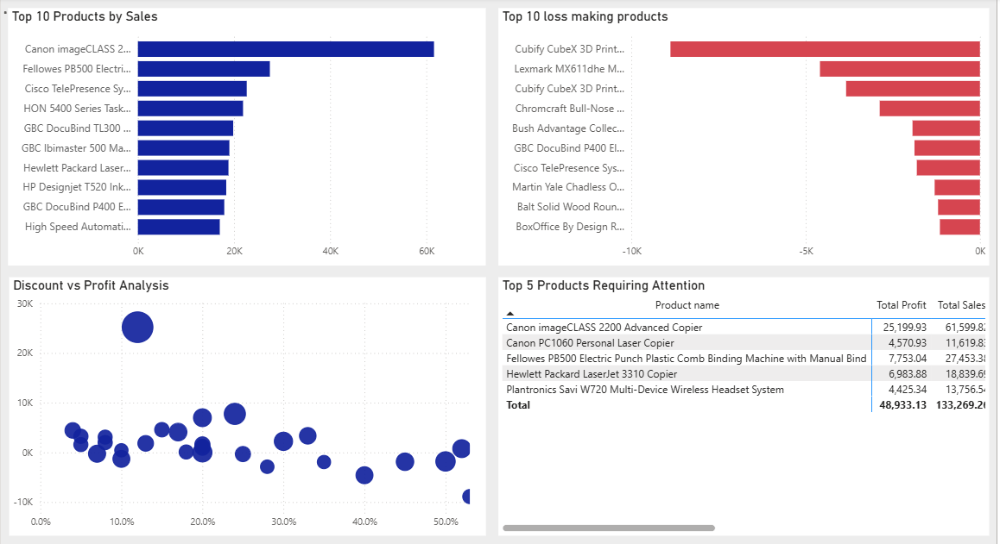
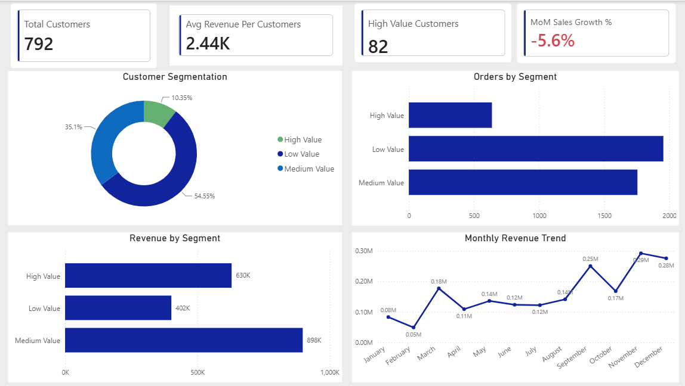

# E-commerce Sales & Project Analytics 

## Project Overview 
Built an end-to-end analytics solution using SQL (PostgreSQL), Power BI, and Excel to analyze sales performance, customer behavior, and profitability.

**Tools Used** 
- PostgreSQL
- SQL
- Power BI
- DAX
- Microsoft Excel

## Project Workflow
Raw Dataset (Excel) -> PostgreSQL Import -> Data Cleaning -> SQL Analysis -> DAX Measures -> Power BI Dashboard -> Business Insights & Performance Analysis 

## Key Performance Indicators (KPIs) 
- Total Sales: 1.9M
- Total Profit: 250K
- Total Orders: 4K
- Profit Margin: 12.9%

## Key Features 
- Built KPI cards and DAX measures.
- Created month-over-month sales growth calculations.
- Developed a three-page interactive dashboard.
- Analyzed customer behavior and product profitability.
- Identified sales trends and loss-making products.

## Dashboard Pages 

### Executive Summary 

Sales, profit, orders and growth analysis.

### Product Insights 

Category performance, discounts, and loss-making products.

### Customer & Growth Insights

Customer behavior, trends, and business opportunities.

## Skills Demonstrated
- SQL & PostgreSQL
- Power BI & DAX
- Data Cleaning
- Dashboard Development
- KPI Reporting
- Business Intelligence

## Dashboard Preview 

### Executive Summary 

### Product Insights 

### Customer & Growth Insights 

